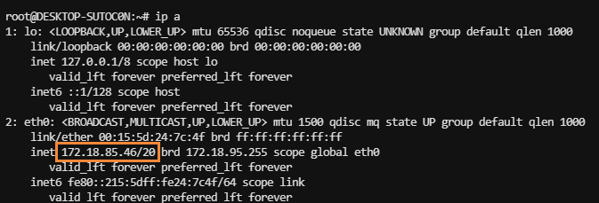

# Remote Connection

- [Remote Connection](#remote-connection)
    * [1.Installation](#1installation)
        + [1.1 Install SSH](#11-install-ssh)
        + [1.2 Modify the Configuration](#12-modify-the-configuration)
    * [2. Connection](#2-connection)
    * [Reference](#reference)

## 1.Installation

### 1.1 Install SSH

```shell
sudo apt install openssh-server
```

We can use the following command to check if the ssh server is running.

```shell
systemctl status sshd
```


### 1.2 Modify the Configuration

1. **Edit the configuration file of ssh.**

    ```shell
    sudo vim /etc/ssh/sshd_config
    ```

   
   This means that we need password to connect the remote linux server.

2. **Restart**
    ```shell
    sudo systemctl restart ssh
    ```

***

## 2. Connection

1. **View address of the server.**

   ```shell
   ip a
   ```

   

2. Connection
   ```shell
   ip: 172.18.85.46
   port: 22
   ```

***

## Reference

